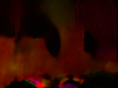
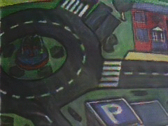

# event_cnn_minimal
Minimal code for running inference on models trained for ECCV'20.

# Running with [Anaconda](https://docs.anaconda.com/anaconda/install/)
```
cuda_version=10.1

conda create -y -n event_cnn python=3.7
conda activate event_cnn
conda install -y pytorch torchvision cudatoolkit=$cuda_version -c pytorch
conda install -y -c conda-forge opencv
conda install -y -c conda-forge tqdm
conda install -y -c anaconda h5py 
conda install -y -c intel pandas
conda install -y -c anaconda scikit-image
pip install thop --user
```
As a further prerequisite, you will need to have [ROS](http://wiki.ros.org/kinetic/Installation/Ubuntu) installed on your system. Make sure not to source your ROS and Conda envs at the same time, as they conflict.
# Usage

Clone this repo and submodules:
```
git clone -b inference git@github.com:TimoStoff/event_cnn_minimal.git --recursive
cd event_cnn_minimal/events_contrast_maximization/
git checkout master
cd ..
```
## Conversion to HDF5
This code processes the events in HDF5 format. To convert the rosbags to this format, open a new terminal and source a ROS workspace.
```
source /opt/ros/kinetic/setup.bash
python events_contrast_maximization/tools/rosbag_to_h5.py <path/to/rosbag/or/dir/with/rosbags> --output_dir <path/to/save_h5_events> --event_topic <event_topic> --image_topic <image_topic>
```
As an example, using [`slider_depth`](http://rpg.ifi.uzh.ch/datasets/davis/slider_depth.bag) from "The event camera dataset and simulator":
```
wget http://rpg.ifi.uzh.ch/datasets/davis/slider_depth.bag -O /tmp/slider_depth.bag
source /opt/ros/kinetic/setup.bash
python events_contrast_maximization/tools/rosbag_to_h5.py /tmp/slider_depth.bag --output_dir /tmp/h5_events --event_topic /dvs/events --image_topic /dvs/image_raw
```
If you have access to [events from a color event camera](http://rpg.ifi.uzh.ch/CED.html), you need to set `image_topic` to the topic containing events and a flag `--is_color`. For example, using [`carpet_simple.bag`](http://rpg.ifi.uzh.ch/CED/datasets/CED_simple.zip):
```
python events_contrast_maximization/tools/rosbag_to_h5.py /tmp/simple_carpet.bag --image_topic /dvs/image_color --is_color
```
## Inference
Download the pretrained models from [here](https://drive.google.com/open?id=1J6PbqYPOGlyspYsdH4fgg5pZpc_l-BOD), into event_cnn_minimal.

To estimate reconstruction:
```
python inference.py --checkpoint_path <path/to/model.pth> --device 0 --h5_file_path </path/to/events.h5> --output_folder </path/to/output/dir>
```
For example:
```
python inference.py --checkpoint_path pretrained/reconstruction/reconstruction_model.pth --device 0 --h5_file_path /tmp/h5_events/slider_depth.h5 --output_folder /tmp/reconstruction --legacy
```
To estimate flow:
```
python inference.py --checkpoint_path <path/to/model.pth> --device 0 --h5_file_path </path/to/events.h5> --output_folder </path/to/output/dir> --is_flow
```
For example:
```
python inference.py --checkpoint_path pretrained/flow/flow_model.pth --device 0 --h5_file_path /tmp/h5_events/slider_depth.h5 --output_folder /tmp/flow --legacy --is_flow
```
Flow is saved as both a png showing HSV color as slow vectors and as npy files. Should look something like this:




Note that the models reported on in the preprint ["How to Train Your Event Camera Neural Network](https://arxiv.org/abs/2003.09078) loaded the voxels in a slightly different way to more recent versions. Hence when running inference on those models, the `--legacy` flag is necessary. More recent models are denoted by the prefix `update_` and don't require this flag to be set.
*The update models have not been quantitatively tested and are not necessarily better.*

# Citations
Please cite the following if you decide to use this code in an academic context:
```
@misc{stoffregen2020train,
    title={How to Train Your Event Camera Neural Network},
    author={Timo Stoffregen and Cedric Scheerlinck and Davide Scaramuzza and Tom Drummond and Nick Barnes and Lindsay Kleeman and Robert Mahony},
    year={2020},
    eprint={2003.09078},
    archivePrefix={arXiv},
    primaryClass={cs.CV}
}
```
